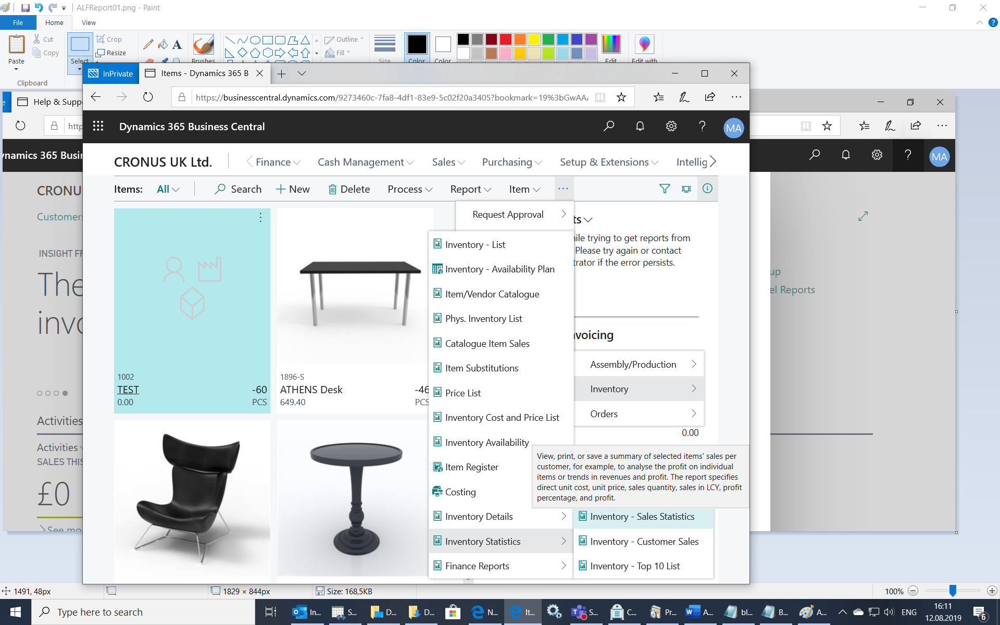
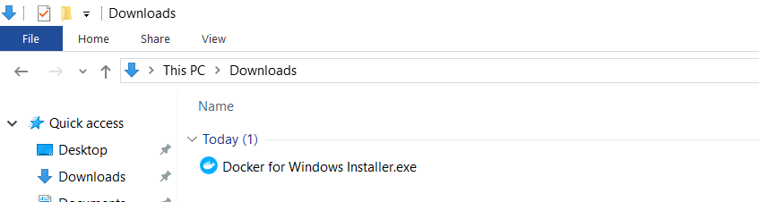
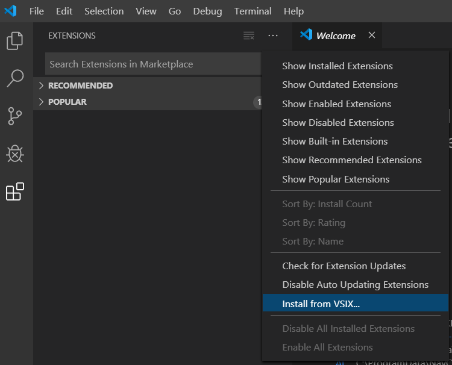
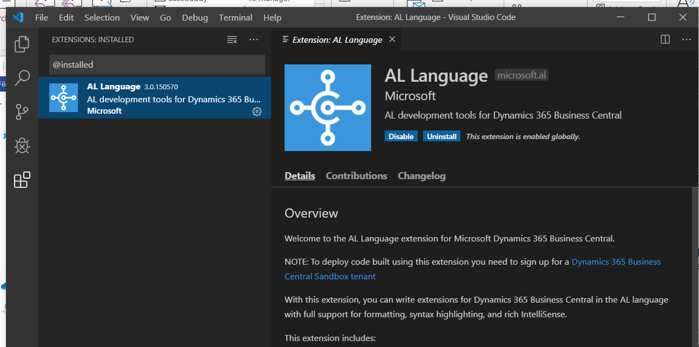
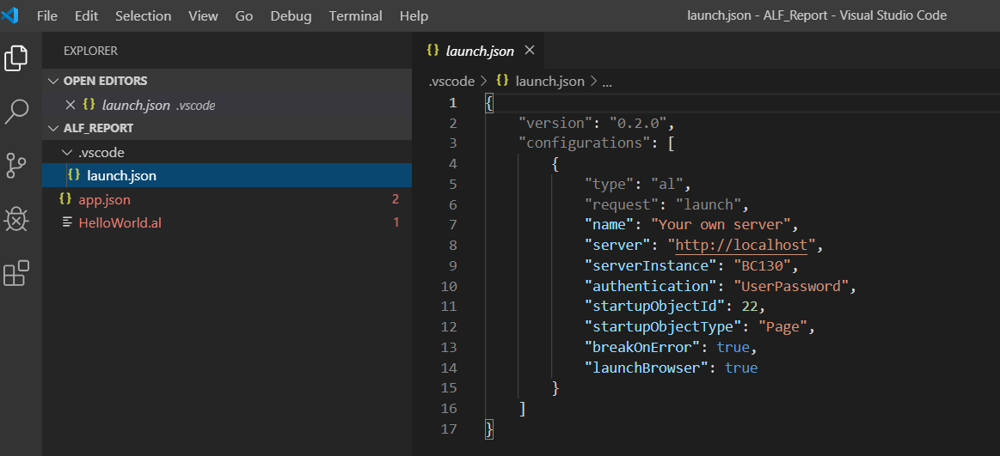
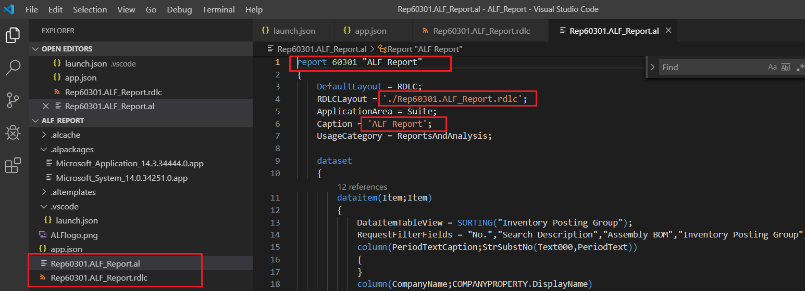
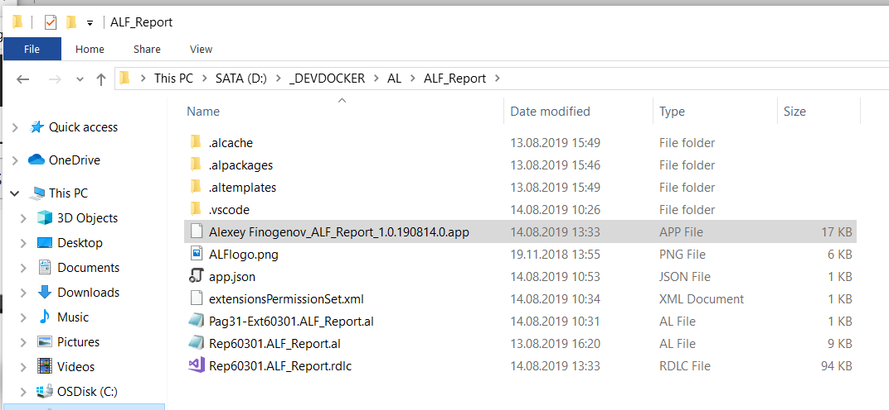
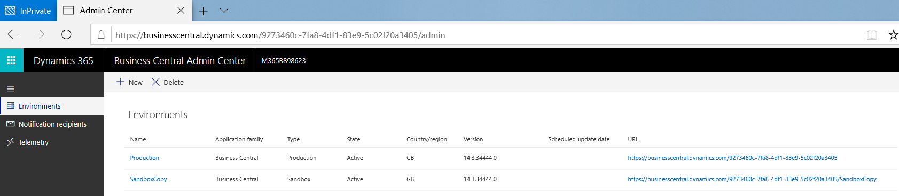
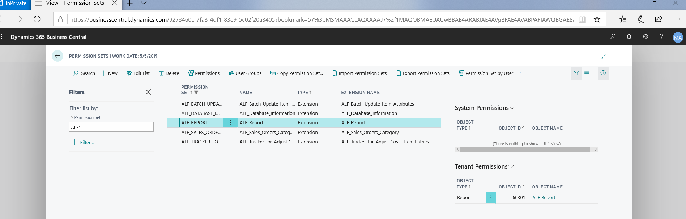

## Example how to add a report in Business Central SaaS/Cloud version with use locally hosted Container Sandbox

> The world is changing … The cloud story pushing us to use modern dev tools, docker container etc.
In this blog post I’ll try to show the example how to add a report in Business Central SaaS/Cloud version with use locally hosted Container Sandbox. The many pictures will below.

Imagine that we have a good old Business Central on-prem version and run report: Inventory - Sales Statistics

The report is grouping data by Inventory Posting Group.
In our example we will try to create copy of this report but with small modification – remove grouping data by Inventory Posting Group. We are going to do it (finally) for Business Central SaaS/Cloud version.

Run Business Central SaaS/Cloud version (I used my test tenant for GB version, 14.3)

My test system already has some extensions, we need to add one more extension.

Now, find report Inventory - Sales Statistics.

Check that we can see detailed info (object number an etc.) via [Page Inspection feature](https://docs.microsoft.com/en-us/dynamics365/business-central/across-inspect-page).
 

In Business Central SaaS/Cloud version press search button, find Sandbox, select Container option.
// more info about sandbox options: [Choosing Your Dynamics 365 Business Central Development Sandbox Environment](https://docs.microsoft.com/en-us/dynamics365/business-central/dev-itpro/developer/devenv-sandbox-overview)

Select Host locally.

As result system provide file with PowerShell script:

	install-module navcontainerhelper -force
	
	# set accept_eula to $true to accept the eula found here: https://go.microsoft.com/fwlink/?linkid=861843
	$accept_eula = $false
	
	$containername = ''
	$navdockerimage = 'mcr.microsoft.com/businesscentral/sandbox:14.3.34444.0-gb'
	$appbacpacuri = ''
	$tenantbacpacuri = ''
	
	$additionalParameters = @()
	if ($appbacpacuri -ne '' -and $tenantbacpacuri -ne '') {
	    $additionalParameters = @("--env appbacpac=""$appbacpacuri""","--env tenantBacpac=""$tenantbacpacuri""")
	}
	
	$credential = get-credential -UserName $env:USERNAME -Message "Using Windows Authentication. Please enter your Windows credentials."
	New-NavContainer -accept_eula:$accept_eula `
	                 -containername $containername `
	                 -auth Windows `
	                 -Credential $credential `
	                 -includeCSide `
	                 -alwaysPull `
	                 -doNotExportObjectsToText `
	                 -usessl:$false `
	                 -updateHosts `
	                 -assignPremiumPlan `
	                 -shortcuts Desktop `
	                 -imageName $navdockerimage `
	                 -additionalParameters $additionalParameters

	Setup-NavContainerTestUsers -containerName $containername -password $credential.Password

Stop a bit at this moment. You see 2 new terms docker and navcontainerhelper.

More info about docker: [Setting up a Dynamics 365 Business Central development environment tenant using Docker](https://youtu.be/GkYJX_ouJQo)

More info about navcontainerhelper:

[NavContainerHelper | Freddys blog](https://freddysblog.com/category/navcontainerhelper/)

[microsoft/navcontainerhelper: Official Microsoft repository for NavContainerHelper, a PowerShell module, which makes it easier](https://github.com/microsoft/navcontainerhelper)
 
[Businesscentral Onprem - Docker Hub](https://hub.docker.com/_/microsoft-businesscentral-onprem)
 
[Businesscentral Sandbox - Docker Hub](https://hub.docker.com/_/microsoft-businesscentral-sandbox)

Now, install docker from this link [Install Docker Desktop for Windows | Docker Documentation](https://docs.docker.com/docker-for-windows/install/)
// my PC: Windows 10 with 32 GB memory

Run Docker Desktop.

Close Welcome page.

Run as administrator Windows PowerShell ISE. // [Introducing the Windows PowerShell ISE | Microsoft Docs](https://docs.microsoft.com/en-us/powershell/scripting/components/ise/introducing-the-windows-powershell-ise?view=powershell-6)

Check docker info.

	docker info

Continue. Install navcontainerhelper

	install-module navcontainerhelper -force

	Get-InstalledModule -Name navcontainerhelper -AllVersions

// For uninstall navcontainerhelper you can use

	Get-InstalledModule -Name navcontainerhelper -AllVersions | Uninstall-Module

Check that folder C:\ProgramData\NavContainerHelper is empty:

Stop a bit.

What version of Business Central (image) I should use?

I’ve decided initially to create an extension for on-prem (W1) version.

I am an old-fashioned guy.

// The report that we discuss (712) is the same for W1,GB... versions.

Don’t warry ... I will have the extension in cloud at the end of story.

Now run the script:

// On my test the total time for the script about 24 mins (pull/download ~ 10 mins; create container ~ 2 mins; export/converting objects ~ 12 mins).

// I use the heavy/developers license for Business Central container.

	$accept_eula = $true
	$containername = 'BCONPREM-143-W1'
	$navdockerimage = 'mcr.microsoft.com/businesscentral/onprem:14.3.34444.0-w1'
	$credential = get-credential -UserName $env:USERNAME -Message "Using Windows Authentication. Please enter your Windows credentials."
	$licenseFile = "D:\DEVDOCKER\build.flf"
	
	New-BCContainer  -accept_eula:$accept_eula `
                 -containername $containername `
                 -auth Windows `
                 -Credential $credential `
                 -includeCSide `
                 -usessl:$false `
                 -updateHosts `
                 -licenseFile $licenseFile `
                 -shortcuts Desktop `
                 -imageName $navdockerimage `
                 -includeAL `
                 -memoryLimit 10G

**Key lines from output:**

	Container IP Address: 172.29.177.232
	Container Hostname  : BCONPREM-143-W1
	Container Dns Name  : BCONPREM-143-W1
	Web Client          : http://BCONPREM-143-W1/NAV/
	Dev. Server         : http://BCONPREM-143-W1
	Dev. ServerInstance : NAV
	
	Files:
	http://BCONPREM-143-W1:8080/al-3.0.150570.vsix

After finishing the script, we see Desktop shortcuts:

And… Folder C:\ProgramData\NavContainerHelper\Extensions

… has subfolder **Original-14.3.34444.0-W1-al**

Check images and containers.

	docker images
	docker ps

Copy Desktop shortcuts and folder Original-14.3.34444.0-W1-al to D:\_DEVDOCKER and run Web client

Now time to install Visual Studio Code.
Use this link [Visual Studio Code - Code Editing. Redefined](https://code.visualstudio.com/)

Run in browser http://BCONPREM-143-W1:8080/al-3.0.150570.vsix 
// Take the link from “Key lines from output:” (look upper to the blog post)

As result system provide .vsix file.

Open Visual Studio Code and install Visual Studio extension (**AL Language**) from VSIX file:

Great. Now we can create AL project.

View \ Command Palette…

	AL: Go

Select path to an AL project folder (D:\_DEVDOCKER\AL\ALF_Report)

Select server (Your own server)

Default launch.json

Default app.json

Modify launch.json

	{
	    "version": "0.2.0",
	    "configurations": [
	        {
	            "type": "al",
	            "request": "launch",
	            "name": "local Docker BCONPREM-143-W1",
	            "server": "http://BCONPREM-143-W1",
	            "serverInstance": "NAV",
	            "authentication": "Windows",
	            "startupObjectId": 31,
	            "startupObjectType": "Page",
	            "breakOnError": true,
	            "launchBrowser": true,
	            "port":7049,
	            "schemaUpdateMode": "Recreate"
	        }
	    ]
	}

Add logo file to the root of the AL project.

Modify app.json

	{
	  "id": "dc8aec40-2d74-46b8-ae63-10949e50bf0a",
	  "name": "ALF_Report",
	  "publisher": "Alexey Finogenov",
	  "version": "1.0.190813.0",
	  "brief": "",
	  "description": "ALF Report, report: Inventory - Sales Statistics; remove grouping data by Inventory Posting Group.",
	  "privacyStatement": "",
	  "EULA": "",
	  "help": "https://github.com/finn777/ALF_Report/blob/master/readme.md",
	  "url": "https://github.com/finn777/ALF_Report/blob/master/readme.md",
	  "logo": "ALFLogo.png",
	  "dependencies": [],
	  "screenshots": [],
	  "platform": "14.0.0.0",
	  "application": "14.0.0.0",
	  "idRanges": [
	    {
	      "from": 60301,
	      "to": 60301
	    }
	  ],
	  "contextSensitiveHelpUrl": "https://ALF_Report.com/help/",
	  "showMyCode": true,
	  "runtime": "3.2"
	}

Delete HelloWorld.al

View \ Command Palette…

	AL: Download symbols

As result we should see Microsoft .alpackages

*Well, now we need to use ‘an old trick’ take an exist standard object, rename it, set new object id and later modify a bit.*

**All standard objects in .al format already in our folder Original-14.3.34444.0-W1-al**

Search in folder by InventorySalesStatistics (in general .al name containing one word that convert from c/al name with exclude space, dash etc.)

Copy files InventorySalesStatistics.rdlc;  InventorySalesStatistics.Report.al to the root of the AL project.

Return to Visual Studio Code.

Rename
 
InventorySalesStatistics.rdlc -> Rep60301.ALF_Report.rdlc;

InventorySalesStatistics.Report.al -> Rep60301.ALF_Report.al.
 
Set new object id, caption, label etc.

View \ Command Palette…

	AL: Publish

As result Visual Studio Code run Business Central Web client, search by new object name.

Run new report.

Now we are going to add some improvements/modifications.

Firstly, I would suggest install Visual Studio extension (**AL Object Designer**) from marketplace:

View \ Command Palette…

	AL Object Designer

With AL Object Designer you could easy find the standard object and run it directly from Visual Studio Code:

We run Page 31 (Item List) and play with it… find the place for new menu item:

Well, add page extension Pag31-Ext60301.ALF_Report.al (need to do it for add a new menu item)

	pageextension 60301 ALF_Report extends "Item List"
	{
	    layout
	    {
	        // Add changes to page layout here
	    }
	    
	    actions
	    {
	        // Add changes to page actions here
	        addafter("Inventory - Sales Back Orders")
	        {
	
	                action("ALF Report")
	                
	                {
	                    ApplicationArea = All;
	                    Caption = 'ALF Report';
	                    Image = "Report";
	                    Promoted = true;
	                    PromotedCategory = "Report";
	                    RunObject = Report "ALF Report";
	                    ToolTip = 'ALF Report (Inventory - Sales Statistics)...';                 
	                }        
	        }        
	
	    } 
	 }

View \ Command Palette…

	AL: Generate permission set containing current extension objects

Now we are going to modify .rdlc file.

I’ve already has Report Builder and Visual Studio.

More about it:

[System Requirements for Business Central - Business Central | Microsoft Docs](https://docs.microsoft.com/en-us/dynamics365/business-central/dev-itpro/deployment/system-requirement-business-central)

[How Do I: Configure my RDLC layout designers for VSCode? – think about IT](https://thinkaboutit.be/2019/01/how-do-i-configure-my-rdlc-layout-designers-for-vscode/)

[How Do I : Create a Document Report, and layout, in VSCode? (part1) – think about IT](https://thinkaboutit.be/2019/01/how-do-i-create-a-document-report-and-layout-in-vscode-part1/)

[How Do I : Create a Document Report, and layout, in VSCode? (part2) – think about IT](https://thinkaboutit.be/2019/01/how-do-i-create-a-document-report-and-layout-in-vscode-part2/)

Remove grouping data by Inventory Posting Group:

Add Sorting by Profit:

Go to app.json and set version: "version": "1.0.1908**14**.0" 
// in general I use such type of version 1.0.YYMMDD.0 where YYMMDD is date when I modify the project

View \ Command Palette…

	AL: Publish

Run new report (second version).

Great. Let’s try to test our Extension with Sandbox (Container option).

Run as administrator Windows PowerShell ISE. Run the script.

	$accept_eula = $true
	$containername = 'BCSAND-143-GB'
	$navdockerimage = 'mcr.microsoft.com/businesscentral/sandbox:14.3.34444.0-gb'
	$credential = get-credential -UserName $env:USERNAME -Message "Using Windows Authentication. Please enter your Windows credentials."
	$licenseFile = "D:\DEVDOCKER\build.flf"
	
	New-BCContainer  -accept_eula:$accept_eula `
                 -containername $containername `
                 -auth Windows `
                 -Credential $credential `
                 -includeCSide `
                 -doNotExportObjectsToText `
                 -usessl:$false `
                 -updateHosts `
                 -licenseFile $licenseFile `
                 -assignPremiumPlan `
                 -shortcuts Desktop `
                 -imageName $navdockerimage
	Setup-NavContainerTestUsers -containerName $containername -password $credential.Password

As result

**Key lines from output 2:**

	Assign Premium plan for BCSAND-143-GB\ALEXEF
	Container IP Address: 172.29.180.244
	Container Hostname  : BCSAND-143-GB
	Container Dns Name  : BCSAND-143-GB
	Web Client          : http://BCSAND-143-GB/NAV/
	Dev. Server         : http://BCSAND-143-GB
	Dev. ServerInstance : NAV
	
	Files:
	http://BCSAND-143-GB:8080/al-3.0.150570.vsix

Check images and containers.

	docker images
	docker ps

If you lost ‘output’ then you can always use:

	Get-NavContainerDebugInfo BCSAND-143-GB

Copy shortcuts to our DEV folder.

Run Web client.

Return to Visual Studio Code. Modify launch.json

*The launch.json file contains an array of configurations. By default, only one
configuration is created, but if you intend to automatically deploy the same application into
different test environments, you could specify different configuration elements in the JSON
array.
*

	{
	    "version": "0.2.0",
	    "configurations": [
	        {
	            "type": "al",
	            "request": "launch",
	            "name": "local Docker BCONPREM-143-W1",
	            "server": "http://BCONPREM-143-W1",
	            "serverInstance": "NAV",
	            "authentication": "Windows",
	            "startupObjectId": 31,
	            "startupObjectType": "Page",
	            "breakOnError": true,
	            "launchBrowser": true,
	            "port":7049,
	            "schemaUpdateMode": "Recreate"
	        },
	        {
	            "type": "al",
	            "request": "launch",
	            "name": "local Docker BCSAND-143-GB",
	            "server": "http://BCSAND-143-GB",
	            "serverInstance": "NAV",
	            "authentication": "Windows",
	            "startupObjectId": 31,
	            "startupObjectType": "Page",
	            "breakOnError": true,
	            "launchBrowser": true,
	            "port":7049,
	            "schemaUpdateMode": "Recreate"
	        }
	    ]
	}

*When downloading symbols or deploying an extension, the AL languge runtime will
prompt you to choose which of the launch.json array elements will determine the
connection parameters.
*

	AL: Publish

Skip PowerBI problem // From my understanding our container work locally and cannot connect service

As result we can see our new menu item.

Well, we have .app (Alexey Finogenov_ALF_Report_1.0.190814.0) golden file in our hands:

Let’s test our .app file with real Cloud/SaaS tenant.
This is our Production tenant:

Open admin console, just add “/admin” to link:

Create new Sandbox (**Copy production data**) tenant:

Go to Extension Management (SandboxCopy), we can see all early installed production (own) extensions:

Upload Extension (Select our .app file)

(**In real situation you could spend some time for tests on SandboxCopy**)

Well, open our Production tenant, Upload Extension:

Run new report (Cloud/SaaS production tenant).

Check Permission Set:

Github project: [https://github.com/finn777/ALF_Report](https://github.com/finn777/ALF_Report)
 
Readme: [https://github.com/finn777/ALF_Report/blob/master/readme.md](https://github.com/finn777/ALF_Report/blob/master/readme.md)
 
.app file: [https://github.com/finn777/ALF_Report/blob/master/Alexey%20Finogenov_ALF_Report_1.0.190814.0.app](https://github.com/finn777/ALF_Report/blob/master/Alexey%20Finogenov_ALF_Report_1.0.190814.0.app)

**Useful links:**

[Page Inspection feature](https://docs.microsoft.com/en-us/dynamics365/business-central/across-inspect-page)

[Choosing Your Dynamics 365 Business Central Development Sandbox Environment](https://docs.microsoft.com/en-us/dynamics365/business-central/dev-itpro/developer/devenv-sandbox-overview)

[Setting up a Dynamics 365 Business Central development environment tenant using Docker](https://youtu.be/GkYJX_ouJQo)

[NavContainerHelper | Freddys blog](https://freddysblog.com/category/navcontainerhelper/)

[microsoft/navcontainerhelper: Official Microsoft repository for NavContainerHelper, a PowerShell module, which makes it easier](https://github.com/microsoft/navcontainerhelper)
 
[Businesscentral Onprem - Docker Hub](https://hub.docker.com/_/microsoft-businesscentral-onprem)
 
[Businesscentral Sandbox - Docker Hub](https://hub.docker.com/_/microsoft-businesscentral-sandbox)

[Install Docker Desktop for Windows | Docker Documentation](https://docs.docker.com/docker-for-windows/install/)

[Introducing the Windows PowerShell ISE | Microsoft Docs](https://docs.microsoft.com/en-us/powershell/scripting/components/ise/introducing-the-windows-powershell-ise?view=powershell-6)

[Visual Studio Code - Code Editing. Redefined](https://code.visualstudio.com/)

[System Requirements for Business Central - Business Central | Microsoft Docs](https://docs.microsoft.com/en-us/dynamics365/business-central/dev-itpro/deployment/system-requirement-business-central)

[How Do I: Configure my RDLC layout designers for VSCode? – think about IT](https://thinkaboutit.be/2019/01/how-do-i-configure-my-rdlc-layout-designers-for-vscode/)

[How Do I : Create a Document Report, and layout, in VSCode? (part1) – think about IT](https://thinkaboutit.be/2019/01/how-do-i-create-a-document-report-and-layout-in-vscode-part1/)

[How Do I : Create a Document Report, and layout, in VSCode? (part2) – think about IT](https://thinkaboutit.be/2019/01/how-do-i-create-a-document-report-and-layout-in-vscode-part2/)
